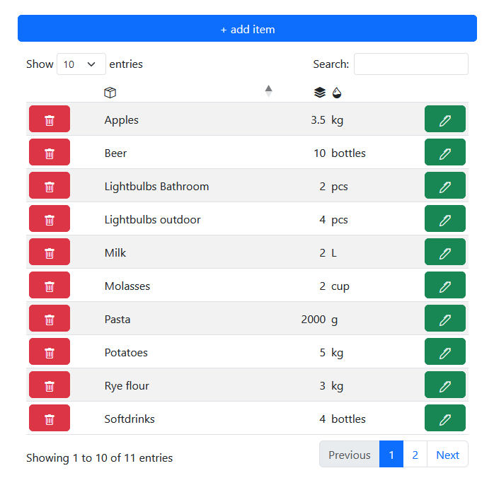

# mInventory

A simple web application based on FastAPI to manage a physical inventory.

## Why?

I am a hobby baker and make fantastic sour-dough bread. I wanted an easier way to keep track of how much of the different flour types I have left to better plan the next shopping trip. I quickly realized that it would also be neat to be able to keep track of all the consumables in the house, like lightbulbs, WD40 or trash bags and have that available during the next spontaneous DIY store visit.

The app is very much under development - check the "Run local development environment" to run a local instance. More deployment options comming some time in the future.

## Easy to use

* add new items with a description, amount and unit
* quickly remove and edit item details
* search and sort thanks to DataTables

## Run local development environment
### Server
* make sure python3.X-venv is installed\
`$ sudo apt install python3.8-venv`

* within the repo directory run\
`$ python -m venv .venv`

* source the virtual environment\
`$ . .venv/bin/activate`

* install requirements\
`$ pip install -r requirements.txt`

* start local http server\
`$ uvicorn main:app --reload`

* leave the virtual environment when needed\
`$ deactivate`

### App
* API documentation under /docs#
